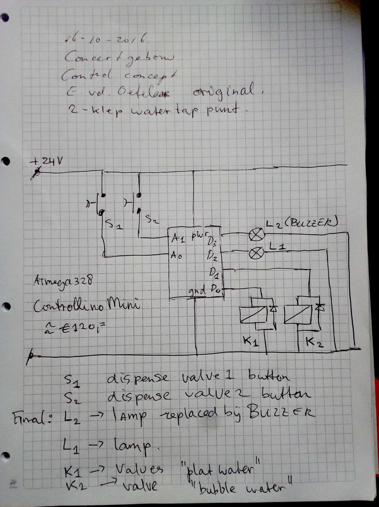

# join_the_pipe water dispenser

__the system is controlled by an Arduino PLC, Controllino Mini__

## Join The Pipe . org Amsterdam (code for custom water dispensing controller Concertgebouw Amsterdam)

This is the code written for a custom project, used in "The Concertgebouw"  in Amsterdam.
It runs on a Arduino Clone with rugged IO : A Controllino MINI.

The code was created by me from scratch, that is : Edwin van den Oetelaar, oktober 2016, for a contract, but maybe someone can learn from it now.
This code was written at night/morning from a friday..saturday, it had to be installed on the next monday.

If you need special project code developed, give me a message ( edwin @ oetelaar dot com )

Also important, __this code is MIT license now, no warranties whatsoever__, it may set your house on fire or get your girlfriend pregnant, use it at your own risk or not use it at all.

Settings of the trained timers are stored inside the eeprom of the controller so it can be installed by someone in the field, trained and will work forever after setup.

[Link to Controllino-Mini Manufacturer](https://www.controllino.biz/product/controllino-mini/)

The system has 2 valves and 2 buttons to dispense water (one flat, one with bubbles)
It also has a buzzer and light to show the internal state to the user of the system.

The teach in mode allowed the timers to be set on the spot.

Pressing the 2 buttons for 2 .. 10 seconds puts the sytem in Auto-dispensing mode.

Pressing the 2 buttons for 10 .. 30 seconds puts it into teach-in mode (training the times for dispensing)

## Some technical details

### The concept sketch

### Inputs must be pulled to HIGH to activate

* buttons on pins 4 and 5 (connected to 24 volt)
* Output flash signal light is on pin 6 (high is active)
* Output buzzer is on pin 7 (high is active)
* Output to activate valve 1 is on pin 14 (active high)
* Output to activate valve 2 is on pin 15 (active high)

## Concerning the design

The system is designed like a PLC, it is a MOORE Finite State Machine.
I like these designs because all state in the system is EXPLICIT in a single place.

* all inputs are sampled atomically
* all outputs are changed atomically
* all logic is a simple table of CurrentState, Inputs and NextState (with outputs for the next state)
* debugging is easy (testing is simple)
* flow control is obvious
* no unexpected changes of the outputs
* no expired timers at random times or unexpected behavior
* The whole system is DETERMINISTIC a DFA (Deterministic Finite Automata) this is what you want in a control system :-)

## General advice

I use this pattern with great success in many applications (including digital hardware devices, that is where I learned it)

Once you know these things everything looks like a __simple state transition table__ :-)

To the young "makers" I would urge : study FSM if you want to be a serious programmer, these are basic skills. Do not just copy and paste Arduino example code without understanding the underlying theory. I see so much bad code online that it hurts my eyeballs.

## Further reading to learn skills

Please read these pages to understand :

* [link to wikipedia : State transition table](https://en.wikipedia.org/wiki/State-transition_table) 
* [link to wikipedia : Moore state machine](https://en.wikipedia.org/wiki/Moore_machine) and also
* [link to wikipedia : Mealy state machine](https://en.wikipedia.org/wiki/Mealy_machine)
* (and figure out why you do not want these in your application)

## Best wishes from me

Good luck and have fun with programming!
-- Edwin (region of Eindhoven Netherlands)

Also a shoutout and greeting to __Richard Hollenbeck__ from [SoftPLC](http://www.softplc.com/products/controllers/) in the USA, a guy I got to know when working on the KiCAD PCB software. 
He builds real Soft PLC's and is good at it. Give this guy a call if you need something more than a Controllino.
